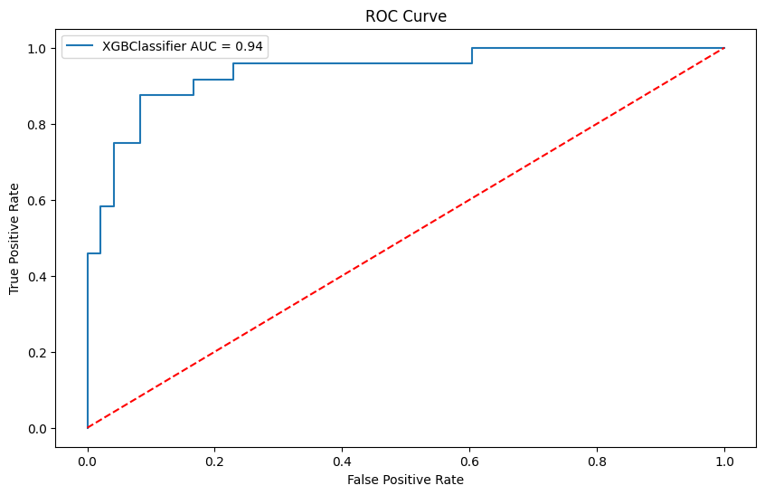

<!-- Start Badges -->
<p align="center">
  <a href="#">
    
    
    
    
    
    
    
    
    
  </a>
</p>
<!-- End Badges --> 

<!-- Start Project Title -->
#  Mini Project 5: Improving Employee Retention By Predicting Employee Attrition Using Machine Learning
<!-- End Project Title -->

<!-- Start Image Acc -->

Photo by <a href="https://unsplash.com/@frantic?utm_content=creditCopyText&utm_medium=referral&utm_source=unsplash">Alex Kotliarskyi</a> on <a href="https://unsplash.com/photos/people-doing-office-works-QBpZGqEMsKg?utm_content=creditCopyText&utm_medium=referral&utm_source=unsplash">Unsplash</a>
<!-- End Image Acc -->

<!-- Start Table of Contents -->
## Table of Contents
1. [📝 Background Project](#background-project)
2. [🔭 Scope of Work](#scope-of-work)
3. [📊 Data and Assumptions](#data-and-assumptions)
4. [📈 Data Analysis](#data-analysis)
5. [🧹 Data Preprocessing](#data-preprocessing)
6. [🤖 Modelling and Evaluation](#modelling-and-evaluation)
7. [🔚 Conclusion](#conclusion)
8. [💻 Installation and Usage](#installation-and-usage)
9. [🙏 Acknowledgements](#acknowledgements)
<!-- End Table of Contents -->

<!-- Start Background Project -->
## Background Project
### What is the problem to solve?
As a member of the Data Scientist team at a technology start-up company. The company is currently experiencing big problems; many of their employees have submitted their resignations, but the company has not yer decided on this matter. I will help the company to explain the current condition of its employees, as well as explore the problems within the company that cause employees to resign, so that the company can make the right decisions to improve employee retention.


### Why is this problem important?
No matter the ecomonic climate, employee retention is critical to the success of any company. It can save the company money, foster a positive work environment, lead to better team member performance, generate more revenue, and create a more stable company culture. Employee retention is a key indicator of company health and success. It is important to understand why employees leave a company and what can be done to retain them.

### What is the goal of this project?
The goal of this project is to predict employee resignations and provide actionable business recommendations to improve employee retention. The company can use the results of this project to make the right decisions to improve employee retention.

### What Will be Changed if There are the Model Results?
If there's model predction results, the company can make the right decisions to use their resources more effectively and efficiently.
<!-- End Background Project -->

<!-- Start Scope of Work -->
## Scope of Work
### What is the scope of this project?
The scope of this project is around predicting employee resignations and providing actionable business recomendations from the data analysis and model results.

### How is the output of the developed model?
The output of the developed model is a prediction of employee resignations and actionable business recommendations to improve employee retention.
<!-- End Scope of WOrk -->

<!-- Start Data and Assumptions -->
## Data and Assumptions
### Data Size
The dataset contains 287 rows and 25 columns.

### Features and Description
|Feature|Description|
|---|---|
|Username|Employee's username|
|Enterprise ID|Employee's enterprise ID|
|StatusPernikahan|Employee's marital status|
|Jenis Kelamin|Employee's gender|
|StatusKepegawaian|Employee's employment status|
|Pekerjaan|Employee's job title|
|JenjangKarir|Employee's career level|
|PerformancePegawai|Employee's performance|
|AsalDaerah|Employee's origin|
|HiringPlatform|Employee's hiring platform|
|SkorSurveyEngagement|Employee's engagement survey score|
|SkorKepuasanPegawai|Employee's satisfaction score|
|JumlahKeikutsertaanProjek|Employee's number of project participations|
|JumlahKeterlambatanSebulanTerakhir|Employee's number of late arrivals in the last month|
|JumlahKetidakhadiran|Employee's number of absences|
|NomorHP|Employee's phone number|
|Email|Employee's email|
|TingkatPendidikan|Employee's education level|
|PernahBekerja|Employee's previous work experience|
|IkutProgramLOP|Employee's LOP program participation|
|AlasanResign|Employee's resignation reason|
|TanggalLahir|Employee's birth date|
|TanggalHiring|Employee's hiring date|
|TanggalPenilaianKaryawan|Employee's evaluation date|
|TanggalResign|Employee's resignation date|

### Assumptions
Based on my domain knowledge from the data analysis, I assume that the following features are important for predicting employee resignations:
- `PerformancePegawai`
- `SkorSurveyEngagement`
- `SkorKepuasanPegawai`
- `JumlahKeikutsertaanProjek`
- `JumlahKeterlambatanSebulanTerakhir`
- `JumlahKetidakhadiran`
- `TingkatPendidikan`
- `JenjangKarir`
- `StatusKepegawaian`
- `Pekerjaan`
- `AsalDaerah`
- `Age` (derived from `TanggalLahir`)
- `EmploymentDuration` (derived from `TanggalHiring` and `TanggalResign`, for more details please see the notebook)
- `HiringToEval` (derived from `TanggalHiring` and `TanggalPenilaianKaryawan`)
The rest of other features are not necessary for predicting employee resignations, because they are Identifiers and some of them are data leakage.
<!-- End Data and Assumptions -->

## Data Analysis
For data preprocessing, I divide the process into two stages:
1. Data Analysis Preprocessing.
2. Machine Learning Preprocessing.

Data Analysis Preprocessing will be explained in this section, while Machine Learning Preprocessing will be explained in the next section.

### Data Analysis Preprocessing
I first create a copy of the original imported data. This copy is used solely for data analysis purposes. In this stage I did the following:
1. Check the data types of each feature.
2. Check for missing values.
3. Check for duplicate rows.
4. Check for unique values in each feature.
5. Define functions to clean the data and create new features to better understand the dataset. The functions will also be used in the Machine Learning Preprocessing stage.
6. Apply the functions to the data.
7. Aggregate the data for analysis.

### Annual Report on Employee Number Changes
#### How many employees remaining over the years?
The number of employees remaining over the years is shown in the following chart:


Insights:
- The number of employees increase significantly from 2010 to 2015, but then decrease significantly from 2016 to 2020.
- From 2016 to 2020, the **company has lost 108 employees** in total, with the highest number of employees resigned in 2018.

#### How many net employees changes over the years?
The net employees changes over the years is shown in the following chart:


Insights:<br>
As have said before, the company's employee number is increasing every year(total resign stil under net hires) from 2006 to 2015, untill 2016 to 2020 the total resign is more than the total hires. This indicates that the company has a problem with employee retention (High Reisgnation Rate).

#### How many percentage of employees resigned in total?
The percentage of employees resigned in total is shown in the following chart:


Insight:<br>
The total Resignation Rate is 31.0% (Mid Imbalanced), while the retention rate is 69.0%. This is a high Resignation rate, which means the company has a problem as said before. Because of this company needs to take action to reducte the resignation rate and increase retention rate, That's why I will develop a predictive model to predict employee resignations and provide actionable business recommendations to improve employee retention.

### Resign Reason Analysis for Employee Attrition Management Strategy
Before analyze the reason for employee resignations, let's see the percentage of employee resigns by Job Position/Title. 

#### How many percentage of employees resigned by Job Position/Title?
The percentage of employees resigned by Job Position/Title is shown in the following chart:


Insights:<br>
The 'Data Analyst' position had the highest resignation rate at 100%. Other positions with resignation rates above 50% include 'Software Engineer (Front End)' at around 63%, 'Product Design (UI & UX)' at around 60%, and 'Product Manager' at around 54%. Positions with resignation rates below 50% include 'Data Engineer', 'Software Engineer (Android)', 'Software Engineer (Back End)', and the remaining job positions.

#### What is Job Employee Resign Reasons by Job Position/Title?
The Job Employee Resign Reasons by Job Position/Title is shown in the following chart:


Insights:<br>
- Data Analyst with the highest resignation rate 100% (from the previous plot), the resignation reason is mostly because of the toxic culture and internal conflict in the compny. This could indicate that employees are feeling unsatisfied with the work environment and the company culture and resolving internal conflicts to retain employees.
- Job Position Software Engineer (Front End & Back End) has pattern that one of the reason their resigned is because they can't work remotely, this could indicate that employees are looking for flexibility in their work arrangements. management need to consider offering remote work or hybrid work options to retain employees.

- From 5 Job Posisitons are resignes because of the jam kerja (work hours), This could indicate that employees are feeling overworked or unsatisfied with the work-life balance offered by the company. Management need to consider redistributing tasks, hiring additional support, or offering flexible work arrangements to improve work-life balance.

- Reason Ganti karir (switch career) or like kejelasan karir (career clarity) is also a common em ployee's reason for resign in the company with 5 job positions is resigned because of this reason. This could indicate that employees are looking for new challenges or better career opportunities. Management need to consider offering career development opportunities, training programs, or promotions to retain employees. 

Actionable Business Recommendations:
Based on the reasons for employee resignations, the company can take the following actions to improve employee retention:
- For toxic culture and internal conflict:<br>Implement team-building activities, conduct anonymus employee surveys, and offer conflict resoultion training for managers.
- For remote work:<br>Consider offering remote work or hybrid work options.
- For work hours:<br>Consider redistributing tasks, hiring additional support, or offering flexible work arrangements.
- For career development:<br>Create clear career paths, offer mentorship programs, and provide opportunities for skil development through training or conferences.

#### How is the Employee resignation by career level and performance?
The Employee resignation by career level and performance is shown in the following chart:


Insights:<br>
- There's a higher resignation rate among fresh graduates, often due to "ganti karir" (switch career) and lack of remote work options. This suggests a mismatch between expectations and reality or lack of early career support.

- The company is losing good talent ("sangat Bagus", "Bagus", "Biasa") across all levels. This highlights a need to address reasons for resignation across the board.

- "Jam kerja" (long work hours) and lack of remote work options are common reasons for resignation across levels, indicating a work-life balance issue and need for flexilble work arrangements.

- "Ganti karir" (switch career) and "kejelasan karir" (career clarity) are common reasons are common reasons for resignation across levels, Additionaly, "toxic culture" and "leadership" issues contribute to resignations at all levels.

Actionable Business Recommendations:<br>
- Targeted Onboarding and Early Career Development:
  - Implement a structured onboarding program for freshgraduates, including mentorship and career exploration opportunities.
  - Offer clear career paths with defined milestones and training programs spesific to each career level.

- Improved Work-Life and Flexibility:
  - Analyze workloads and redistribute tasks to prevent burnout
  - Consifer offering a remote work program or hybrid model to cater to employee preference.
  - Implement flexible scheduling options, if possible.

- Retention Strategies for High-Performing Employees:
  - Conduct exit interviews with high-performing employees to understand their reasons for leaving.
  - Offer competitive compensation packages and benefits to retain top talent.
  - Provide opportunities for career growth and development, such as promotions or leadership training.

- Addressing Culture and Leadership:
  - Conduct anonymous employee surveys to identify areas for improvement in company culture and leadership effectiveness.
  - Implement team-building activities and conflict resolution training.
  - Offer leadership development programs to improve management skills and employee engagement.


## Machine Learning Modelling
### Data Preprocessing for Machine Learning
I use another copy of the original imported data for this stage. Before performing any preprocessing steps such as handling missing values, I split the data into training and testing sets. This ensures that the preprocessing is done independently for both sets, preventing data leakage and ensuring a fair evaluation of the machine learning model. The data preprocessing steps include:

1. Feature Engineering, applying the FE functions defined in the Data Analysis Preprocessing stage and feature binning for some features so the data distribution is more balanced when train test split and also for more general feature value distribution.

2. Train Test Split, splitting the data into training and testing sets. The training set is used to train the machine learning model (75% of the data), while the testing set is used to evaluate the model's performance (25% of the data).

3. Handling Missing Values, Applying the missing value handling functions defined in the Data Analysis Preprocessing stage.

4. Feature Selection and Feature Encoding, Selecting the features based on PPScore, and encoding the categorical features, for ordinal features I use Ordinal Encoding (Label Encoding) and for nominal features I use One-Hot Encoding. And drop the unnecessary features.

5. Handling Outliers on data train with IQR method(Cap the outliers to Upper and Lowe Bound). 

Before Handling Outliers:


After Handling Outliers:


6. Imbalance Data Handling, Handling the imbalance data on the training set using SMOTE Tomek method.

    

### Modelling and Evaluation
#### Machine Learning model will be Train and Evaluated
The models that will be used in this project are Tree-based models, such as:
- Decision Tree
- Random Forest
- XGBoost
- AdaBoost
- Gradient Boosting
And I also use Logistic Regression because it's a simple model and can be used as a baseline model.

#### Metrics Evaluation
The evaluation metrics crucial for assessing the model are **ROC AUC** (Receiver Operating Characteristic Area Under the Curve) **Recall** and **Precision** due to the imbalanced nature of the data and Business Prespective. And also **Cross validation** with 10 folds are also performed to ensure the model's generalization performance.
From the business perspective, the c*ompany aims to minimize the number of employees incorrectly predicted to stay* (False Negatives) when they actually intend to resign. This is because the **financial implications of hiring and training a new employee** (a consequence of a False Negative) **are greater than the costs associated with retaining an existing employee** (a consequence of a False Positive).
While focusing on Recall, it's also important to maintain a good Precision score. Balancing these two metrics means we can lower the training cost while still lowering the retaining cost. 

#### Models Evaluation
The models are evaluated based on the following metrics and the default threshold of 0.5: 
| Model                     | AUC_train | AUC_test | CrossVal_AUC | Recall_train | Recall_test | Precision_train | Precision_test | F1_train | F1_test |
|---------------------------|-----------|----------|--------------|--------------|-------------|-----------------|----------------|----------|---------|
| LogisticRegression        | 0.962659  | 0.922743 | 0.922286     | 0.892617     | 0.625000    | 0.910959        | 0.833333       | 0.901695 | 0.714286|
| DecisionTreeClassifier    | 1.000000  | 0.875000 | 0.857619     | 1.000000     | 0.833333    | 1.000000        | 0.833333       | 1.000000 | 0.833333|
| RandomForestClassifier    | 1.000000  | 0.907118 | 0.950190     | 1.000000     | 0.541667    | 1.000000        | 0.866667       | 1.000000 | 0.666667|
| AdaBoostClassifier        | 0.984775  | 0.827257 | 0.900476     | 0.919463     | 0.416667    | 0.925676        | 0.714286       | 0.922559 | 0.526316|
| XGBClassifier             | 1.000000  | 0.917535 | 0.965587     | 1.000000     | 0.708333    | 1.000000        | 0.850000       | 1.000000 | 0.772727|
| GradientBoostingClassifier| 1.000000  | 0.920139 | 0.963746     | 1.000000     | 0.666667    | 1.000000        | 0.888889       | 1.000000 | 0.761905|

ROC Curve for each model:


As we can see from the table results of the model and the ROC Curve to compare the model performance, the best model is **XGBClassifier**, even the AUC is the second highest on data test (Logistic Regression has the highest AUC score on data test), but the Recall and Precision are the highest among the other models on data test and Cross Validation. This XGBoost model will be hyperparameter tuned to get the best model performance.
<br>
After hyperparameter tuning with GridSearchCV and manual tuning, the model performance is improved(especially AUC). I also threshold tuning the proabability threshold to get the best model performance based on Recall and Precision.
<br><br>

XGBoost **Before hyperparameter tuning** with the **threshold of 0.22**:

| Model        | AUC_train | AUC_test | CrossVal_AUC | Recall_train | Recall_test | Precision_train | Precision_test | F1_train | F1_test |
|--------------|-----------|----------|--------------|--------------|-------------|-----------------|----------------|----------|---------|
| XGBClassifier| 1.0       | 0.917535 | 0.965587     | 1.0          | 0.791667    | 0.993333        | 0.826087       | 0.996656 | 0.808511|

<br>

XGBoost **After hyperparameter tuning** with the **threshold of 0.22**:
| Model        | AUC_train | AUC_test | CrossVal_AUC | Recall_train | Recall_test | Precision_train | Precision_test | F1_train | F1_test |
|--------------|-----------|----------|--------------|--------------|-------------|-----------------|----------------|----------|---------|
| XGBClassifier| 1.0       | 0.938368 | 0.970127     | 1.0          | 0.875       | 0.986755        | 0.84           | 0.993333 | 0.857143|

<br>

XGBoost ROC Curve After Hyperparameter Tuning:


XGBoost Confusion Matrix:


After hyperparameter tuning, the model performance is improved, as we can see the AUC, Recall, and Precision are increased. With this model we can try to simulate the business impact and make actionable business recommendations to improve employee retention.


#### Model Business Impact Simulation
##### Cost Saving Analysis by Threshold
On this stage, I will try to simulate the Business impact simulation based on the model prediction probability threshold from 0 to 1 with so we can get the best model threshold with the lowest cost. The business impact simulation will be based on the following metrics:
- **Recall**
- **Precision**

 In assumption of the costs:

- Recruitment Cost = 5000
- Training Cost = 2500
- Retention Cost = 2000


``` 
Cost on Default Threshold: $104,500
Cost on Optimal Threshold: $86,000

Cost Difference/Saved between Normal and Optimal Threshold: $18,500
``` 
Based on the cost saving analysis by threshold, the best threshold is 0.25 with the lowest total cost of $86,000.


#### Cost with and without using the model
In assumption 50% of the dataset employee is resign, Cost before and after using the model is shown in the following table:
|Cost Before Using Model|Cost After Using Model|Cost Saving|
|------------------------|----------------------|-----------|
|$342,000              |$86,000            |$256,000   |

Based on the cost saving analysis, the company can save 256,000 by using the model to predict employee resignations and take action to retain employees.

#### XGBoost Model Feature Importances
XGBoost Feature Importances:


From the XGBClassifier feature importances, the top 5 features that have the most impact on predicting employee resignations are:
1. `EmploymentTenure`<br> This feature likely represents the length of time an employee has been with the company. It's a significant feature because employees who have been with the company longer may be less likely to resign, as they have more invested in the company.
2. `HiringPlatform_Google_Search`<br> This feature probably indicates whether the employee was hired through a Google search. It could be that employees who found the job through this method are more or less likely to resign, depending on various factors such as how well the job matched their search criteria.

3. `HiringToEval`<br> This feature could represent the time from hiring to evaluation. It might be significant because it could reflect how quickly an employee is assessed and given feedback, which could impact their job satisfaction and likelihood to resign.

4. `StatusKepegawaian_Outsource`<br> This feature likely indicates whether the employee is outsourced. Outsourced employees might have different job satisfaction levels or job security, which could affect their likelihood to resign.

5. `HiringPlatform_Diversity_Job_Fair / LinkedIn` <br> This feature probably indicates whether the employee was hired through a diversity job fair or LinkedIn. The hiring platform could impact the employee's expectations of the job and the company, which could affect their job satisfaction and likelihood to resign.
<br><br>

XGBoost Model SHAP Values:


Here's what the SHAP values tell us about about each factor's influence the XGBoost model prediction:
- Tenure: Employees with shorter tenures are more likely to resign, according to the model. This suggests that building tenure might increase employee retention.
- Age: The model predicts a higher chance of resignation for younger employees. This could be due to various factors like career exploration or lack of attachment to the company.
- Time to Evaluation: A longer period between hiring and evaluation increase the predicted chance of resignation. This might indicate a need to streamline the evaluation process and provide earlier feedback.
- Hiring Platform: Employees hired through Indeed and LinkedIn are predicted to have a lower chance of resigning. This suggests these platforms might attract candidates with a stronger fit for the company.
- Absences: Interestingly, the model predicts a higher chance of resignation for employees with less absence. This could be because highly engaged employees who rarely miss work might be more likely to seek nwew opportunities if they feel unfulfilled.

- Project Involvement: Employees who have worked on projects are predicted to have a lower chance of resigning. This suggests that project involvement might invrease employee engagement and satisfaction.
- Engagement Scores: A lower employee engagement score predicts a higher chance of resignation. This highlights the importance of fostering a positive work environment and addressing employee concerns.
- Performance: This one seems counterintuitive. The model predicts a higher chance of resignation for high performers, and from the previous data analysis, we know that high performers are more likely to resign. This could be due to high performers seeking new challenges or better opportunities elsewhere.

### Conclusion
In this Project I have analyze the company's employee data to understand the current condition of its employees and explore the problems within the company that cause employees to resign, and already given actionable business recommendations for HR Management to improve employee retention. I have also developed a predictive model to predict employee resignations to save more cost efficientcy. The best model is XGBoost with the AUC score of 0.938368, Recall of 0.875, and Precision of 0.84. The model can help the company to save $256,000 by predicting employee resignations and taking action to retain employees. The top 5 features that have the most impact on predicting employee resignations are `EmploymentTenure`, `HiringPlatform_Google_Search`, `HiringToEval`, `StatusKepegawaian_Outsource`, and `HiringPlatform_Diversity_Job_Fair / LinkedIn`. The SHAP values analysis provides insights into how each feature influences the model's predictions. The company can use the results of this project to make the right decisions to improve employee retention and save costs.

### Installation and Usage
1. Clone this repository
```
git clone
```
2. Install the required libraries
```
pip install -r requirements.txt
```
3. Run the Jupyter Notebook
```
jupyter notebook
```
4. Open the Jupyter Notebook file and run the code

### Acknowledgements
I would like to express my sincere gratitude to [Rakamin Academy](https://www.rakamin.com/) for providing the dataset used in this project. This dataset was instrumental in allowing me to complete this work. Additionally, I would like to thank Mr. [Fiqry Revadiansyah](https://www.linkedin.com/in/fiqryrevadiansyah/) for his invaluable guidance and support throughout the project.


